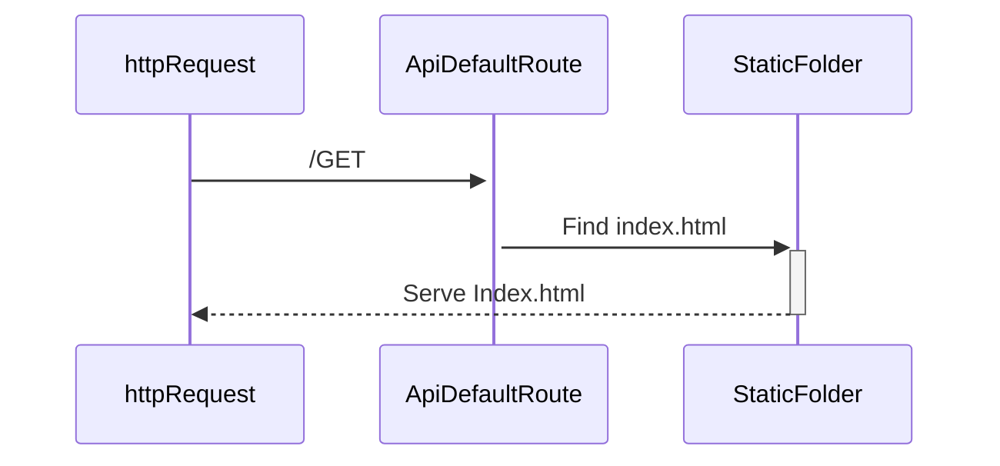
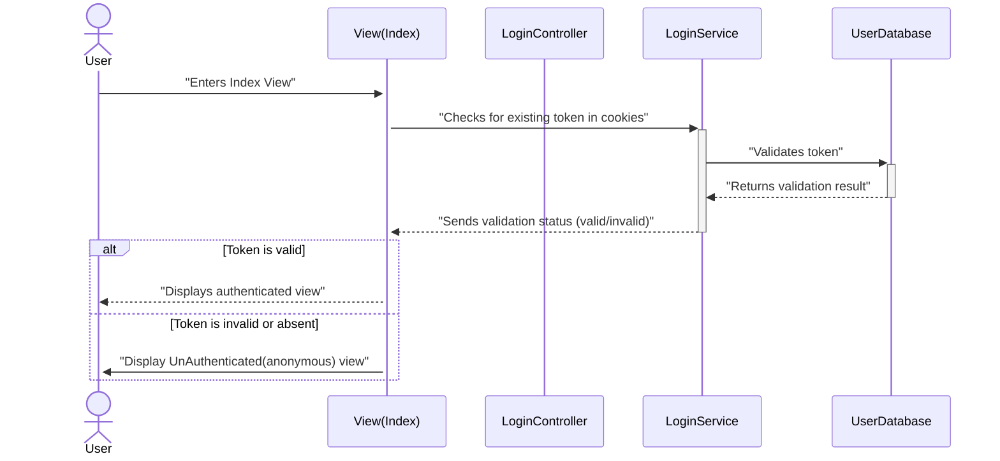
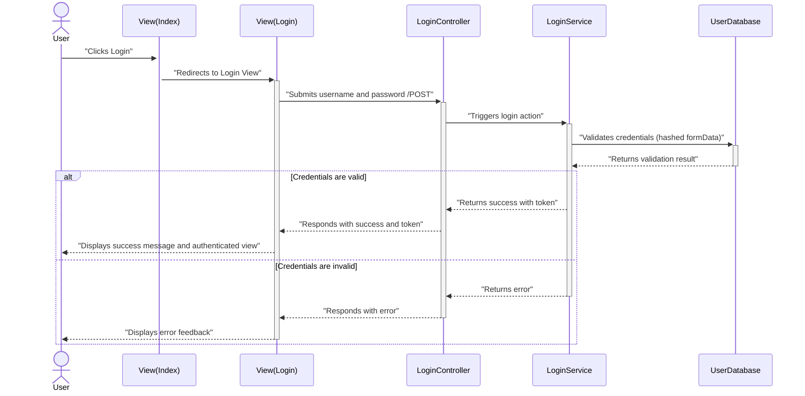
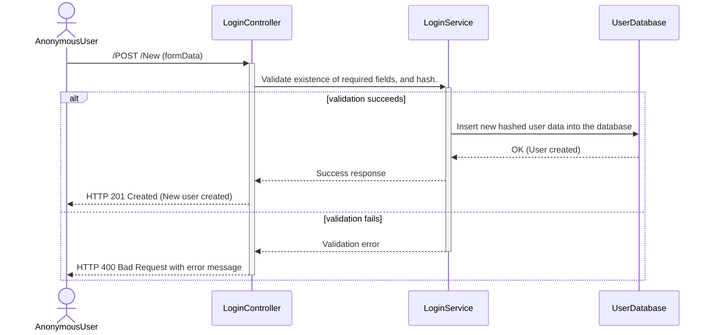
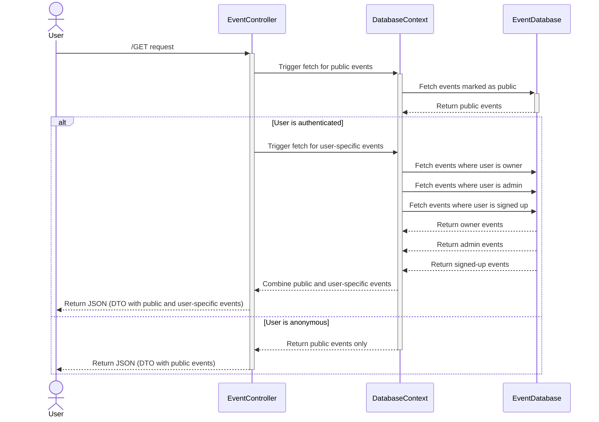
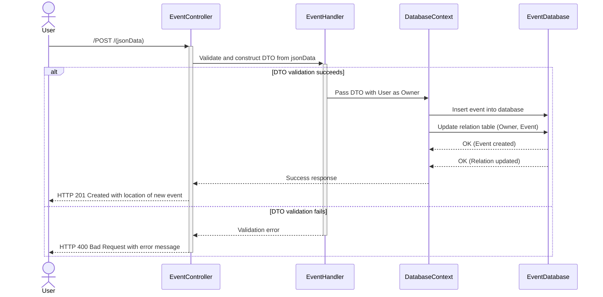
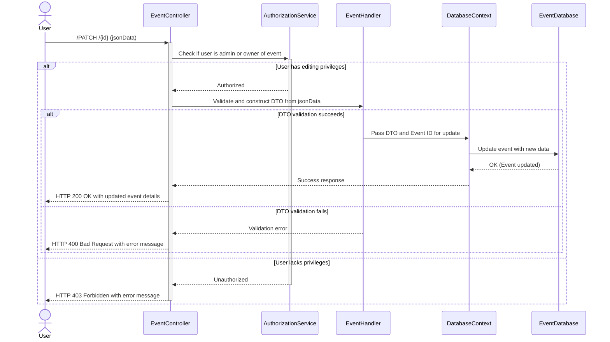
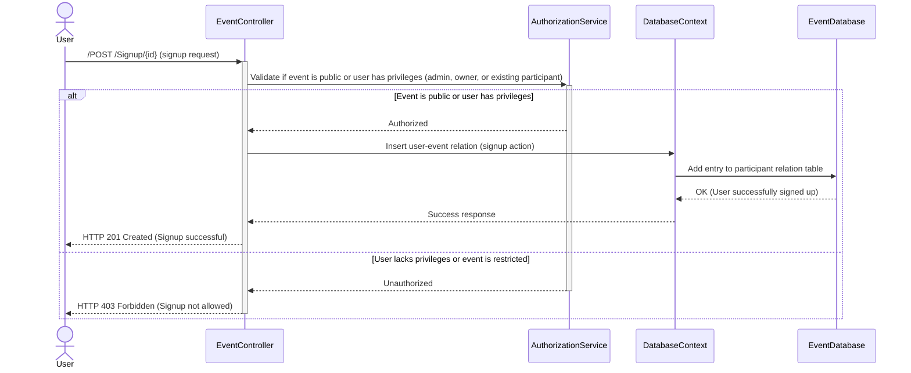
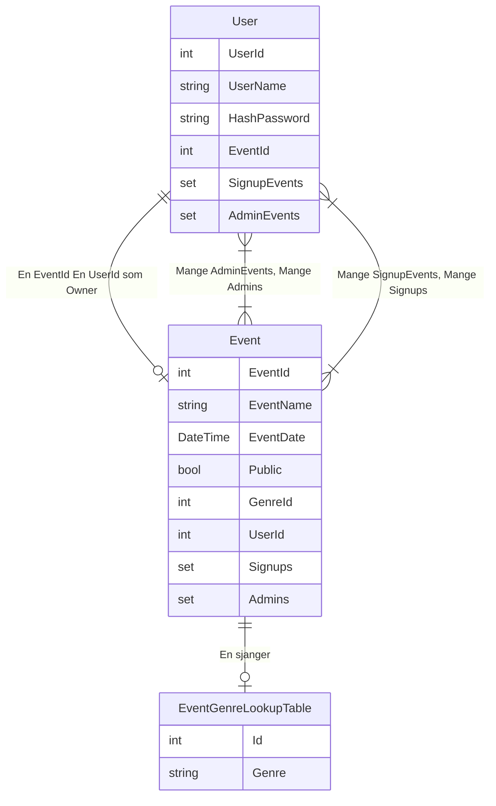

# Event_Signup

Hva ønsker vi å oppnå?
1. Vi skal ha oversikt over events, og brukere som både eier og signer opp til events.
2. En bruker skal kunne signe opp til flere events.
3. En bruker skal kunne eie ett event. 
4. Vi skal bruke SQLite som vår database, for å holde en felles state, samt relasjoner mellom brukere og events.
5. Vi skal ha en front-end, som har forskjellig ui basert på om brukeren eier eller er signet opp til et event.

## Krav for datahåndtering.
1. Vi må kunne ta imot kryptert data fra en httpForm, så skal vi lagre brukernavn, og et hashet passord. Samt returnere en login token tilbake til bruker, slik at vi kan ha persistent login. 
    - Brukere skal kunne lage en ny sidebruker, basert på brukernavn og passord. 
    - Passordet skal aldri lagres i plaintext, og skal kun refereres til i scopet det leses av fra httpForm. 
    - Brukernavn skal også anonymiseres.
2. Vi skal kunne ha oversikt over events.
    - Navn på event.
    - Dato til event.
    - Sjanger på event.
    - lokasjon for event.
    - Maks antall deltagere på eventet. 
    - Eier av eventet.
    - Admin av eventet (ett eller flere).
    - Signups.
3. Vi skal ha oversikt over brukere, og deres relasjoner til et event. Brukere skal kunne gjøre CRUD opperasjoner på disse.
    - En bruker skal kunne lage og eie ett event. (create)
    - En bruker skal kunne lese og signe opp til et eller flere event (Read)
    - Eier av eventet skal kunne oppdatere innhold (update)
    - Eier skal kunne assigne Admins til event.
        - Admins skal kunne Endre innhold i eventet (update).
    - Eier av eventet skal kunne slette eventet (delete)
    Et event skal slette seg selv, når eventet er ferdig. 

## Utførelse og krav til moduler.
Vi ønsker å utføre arbeidet vårt via en .NET backend, en sqlite database som er vår source of truth for dataen vår, samt en front-end i html, css, javascript.

### Backend:
    
 - Vi bruker Entity Framework Core for å holde oversikt og holde databasen vår i memory, og for å gjennomføre migrasjoner og endringer av dataen vår. 
 - Vi lager modeller for all data:
    1. Brukere.
    2. Eventer.
    3. SignupRelasjoner.
    4. AdminRelasjoner.
    5. OwnerRelasjoner.
    6. BrukerDTO.
    7. EventDTO.
 - Vi bruker DTO (data transfer objects) for å flytte data fra forskjellige requests til data som matcher databasemodellene vår. 
 - Vi lager en controller for å hente ut brukerdata. Og en kontroller for å hente ut Event Data.
    - Dette for å gi oss god oversikt over, og klar separasjon mellom, de forskjellige metodene og servicene som brukes av hver.
 - Vi skal lage services som kan holde avansert business logikk.
    - Singleton service for databasen.
    - Singleton service for å håndtere logins.
 - Vi skal serve frontenden vår som en static file. 
    - Den skal være default route til back-enden vår. 
    - Den skal også være Fallback route til back-end.
 - Vi skal ha separat route til en login side, som også er levert som en static fil fra backend, basert på route. 

 ### Frontend:

 - Vi bruker html, css og javascript for å generer vår frontend.
 - Vi skal kun generere Views basert på data fra databasen vår. 
    - Vi skal ikke anta at noe eksisterer, vi skal kunne stole på dataen vi mottar. 
        - Vi skal lage modeller på dataen vi mottar fra backend, og generere views basert på det. 
        - Vi skal bruke .map og object.keys for å mappe over resultater, isteden for å indexe inn etter spesifikke nøkler (anta eksistens).
 - Vi skal ha en frontpage / hero page, som viser forskjellige ting basert på om bruker er logget inn eller ikke.
    - Hvis bruker er ikke logget inn skal hero pagen ikke vise noen data som er koblet til noen bruker. 
        - Kanskje vi kan sette events som public private?
    - Vi skal i Nav elementet vårt, vise tydlig om bruker er logget inn eller ikke. (Vise "Log Inn" / {brukernavn}).
 - Vi skal lage en separat login side, som getter login sin html, og kan Poste brukernavn og passord via en htmlform til login controlleren vår. Her skal vi og redirekte tilbake til "home" ved en suksessfull login. 
 - Vi skal følge moderne stiltyper, for oppsett av css. 
 - Vi skal følge standarder for semnatisk html.

 ## Sekvensdiagrammer:

1. Default Route til api, standard /GET:

2. Sekvens for eksisterende login token. En skjekk som gjennomføres når vi entrer siden.

3. Sekvens for login hvor token ikke eksisterer.

4. Sekvens for å lage en ny user.

5. Sekvens for å hente eventdata til hovedsiden når en bruker entrer defaultRoute.

6. Sekvens for å lage en ny event.

7. Sekvens for å Edite et event. 

8. Sekvens for å signe up til en event.

## Entitetsrelasjonsdiagram

Vi lager relasjonstabeller som skal holde oversikt over hvilken bruker som har en relasjon til hvilken event.
 - User 1..n UserSignupEventRelations n..m Event
 - User 1..n UserAdminEventRelations n..m Event
 - User 1..1 UserOwnerEventRelation 1..1 Event

## Routing

Vi følger prinsippet /Area/Controller/Action/Parameter url prinsippet når det kommer til Routing. 
Det vil si, sekvenser knyttet til EventController har url: api.com/Event/... 
Sekvenser knyttet til LoginController har url: api.com/Login/...  
 

Endepunktene brukt i sekvensdiagrammet er ikke endelige, men representerer godt hva forventningene til backendfunksjonaliteten er for hvert endepunkt:
 - /GET til EventController viser tydlig at vi vil hente data for eventer knyttet til en (potensiell anonym) bruker.
 - /POST til EventController viser tydlig at vi skal Legge til et nytt event.
 - /PATCH/{id} til eventController viser tydlig at vi vil edite/Patche data til en spesifik event med id == {id}.
 - /POST til EventController sin /Signup/{id} action viser tydlig at vi vil poste en ny relation mellom en bruker som "signee" eller "subscriber" og en event. 
 - /POST til LoginController Poster en loginrequest.
 - /Post til LoginController /New poster Ny brukerdata til loginController.